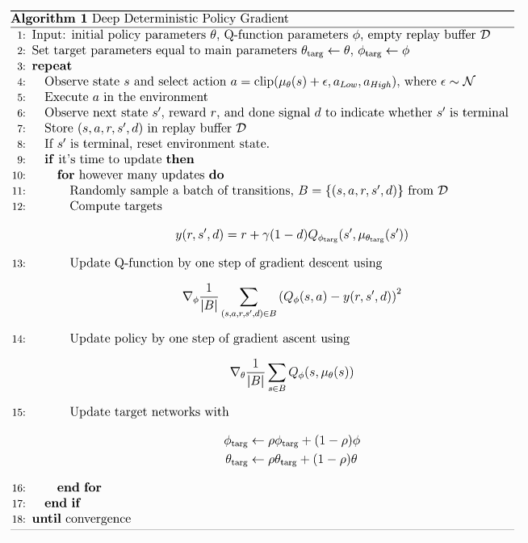

# My DDPG implementation as PL system

## The Algorithm

### Pseudocode





## `LunarLanderContinuous-v2` parameters:
```

```
DDPG net:
```

```

## `BipedalWalker-v3` parameters:
```

```
DDPG net:
```

```

## Credits:

- [DDPG - OpenAI](https://spinningup.openai.com/en/latest/algorithms/ddpg.html)
- [Environments in OpenAI](https://gym.openai.com/envs/#box2d)
- [Optimization In Pytorch-Lightning](https://pytorch-lightning.readthedocs.io/en/latest/common/optimizers.html#automatic-optimization)
- [Adam Grad - page 36 (Training NNs from Stanford's course)](http://cs231n.stanford.edu/slides/2017/cs231n_2017_lecture7.pdf)
- [Kullback–Leibler divergence (YouTube video) - great](https://www.youtube.com/watch?v=ErfnhcEV1O8&ab_channel=Aur%C3%A9lienG%C3%A9ron)
- [Deep-Reinforcement-Learning-Hands-On-Second-Edition (page 512)](https://github.com/PacktPublishing/Deep-Reinforcement-Learning-Hands-On-Second-Edition/tree/master/Chapter17)
- [1 - Deep Deterministic Policy Gradient (DDPG): Theory and Implementation | Medium](https://towardsdatascience.com/deep-deterministic-policy-gradient-ddpg-theory-and-implementation-747a3010e82f)
- [2 - DDPG implementation | Medium](https://towardsdatascience.com/deep-deterministic-policy-gradients-explained-2d94655a9b7b)
- [Policy Gradient Algorithms | Lilian Weng's Blog](https://lilianweng.github.io/lil-log/2018/04/08/policy-gradient-algorithms.html)
- [DATASETS & DATALOADERS | PyTorch](https://pytorch.org/tutorials/beginner/basics/data_tutorial.html)
- [SAVING AND LOADING MODELS | PyTorch](https://pytorch.org/tutorials/beginner/saving_loading_models.html)

## Papers:

- @report{Silver2014,
   author = {David Silver and Nicolas Heess and Thomas Degris and Daan Wierstra and Martin Riedmiller},
   keywords = {ICML,boring formatting information,machine learning},
   title = {2014 - Silver - Deterministic Policy Gradient Algorithms.pdf},
   year = {2014},
} [(paper)](http://proceedings.mlr.press/v32/silver14.pdf)

- @article{Sutton1999,
   author = {Richard S Sutton and David Mcallester and Satinder Singh and Yishay Mansour},
   title = {Policy Gradient Methods for Reinforcement Learning with Function Approximation},
   year = {1999},
} [(paper)](https://proceedings.neurips.cc/paper/1999/file/464d828b85b0bed98e80ade0a5c43b0f-Paper.pdf)

- @article{Lillicrap2016,
   author = {Timothy P Lillicrap and Jonathan J Hunt and Alexander Pritzel and Nicolas Heess and Tom Erez and Yuval Tassa and David Silver and Daan Wierstra},
   title = {CONTINUOUS CONTROL WITH DEEP REINFORCEMENT LEARNING},
   url = { https://goo.gl/J4PIAz },
   year = {2016},
} [(paper)](https://arxiv.org/pdf/1509.02971.pdf)

- @article{weng2018PG,
  title   = "Policy Gradient Algorithms",
  author  = "Weng, Lilian",
  journal = "lilianweng.github.io/lil-log",
  year    = "2018",
  url     = "https://lilianweng.github.io/lil-log/2018/04/08/policy-gradient-algorithms.html"
}


